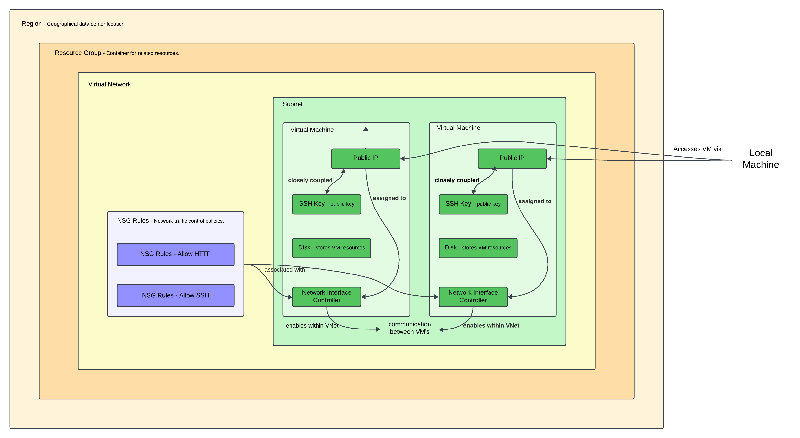
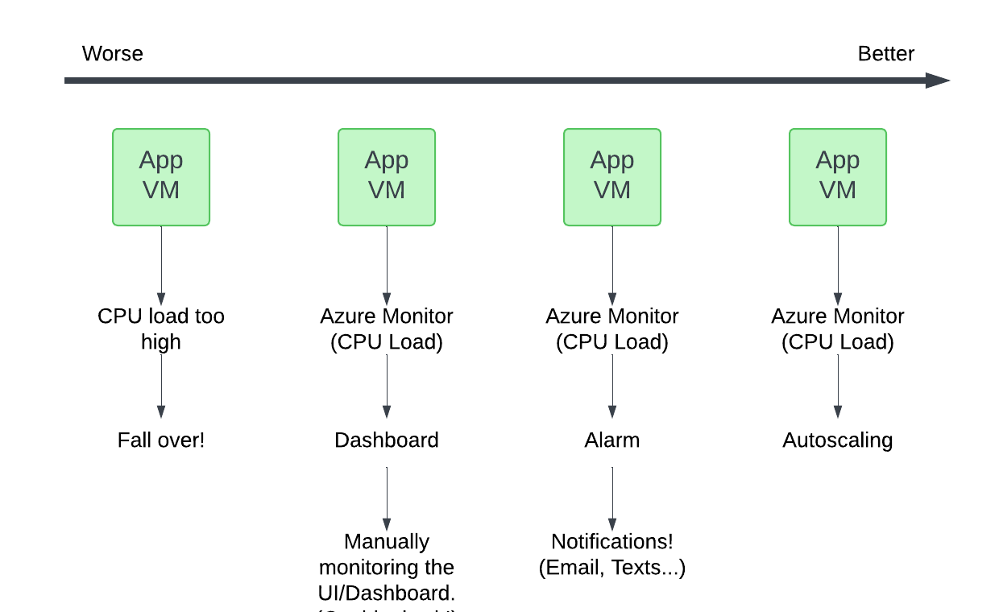
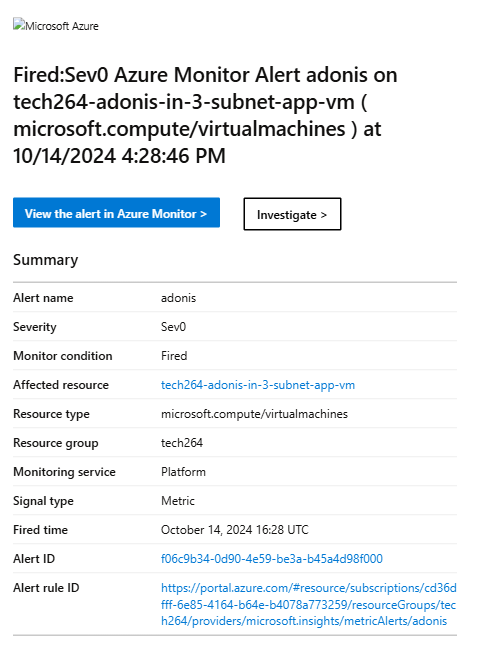
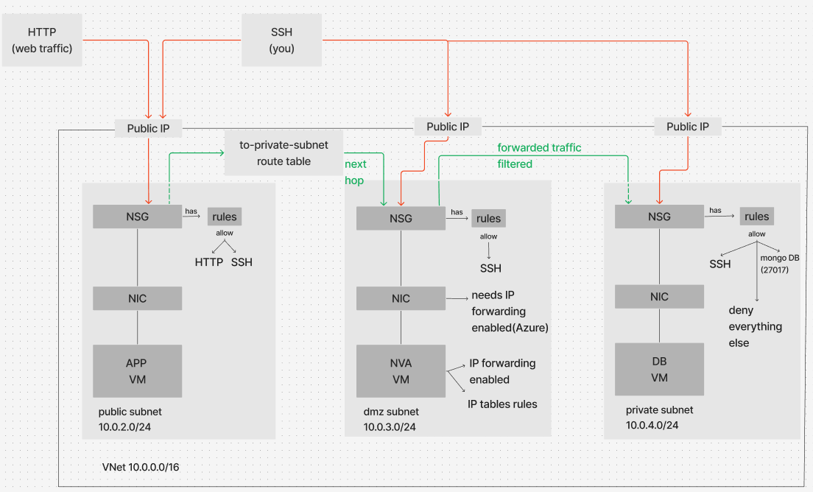
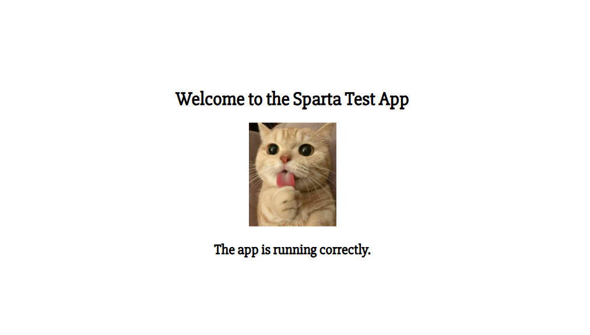

# Learning Cloud Computing - AZURE

- [Learning Cloud Computing - AZURE](#learning-cloud-computing---azure)
  - [The basics of Azure](#the-basics-of-azure)
  - [Azure regions and availability zones.](#azure-regions-and-availability-zones)
  - [How they work together.](#how-they-work-together)
  - [How is Azure structured/organized?](#how-is-azure-structuredorganized)
  - [What types of services does Azure provide?](#what-types-of-services-does-azure-provide)
  - [Ways to access Azure](#ways-to-access-azure)
  - [Difference between Azure and Azure DevOps](#difference-between-azure-and-azure-devops)
  - [Why use the Azure Pricing Calculator?](#why-use-the-azure-pricing-calculator)
  - [Azure Cloud Architecture](#azure-cloud-architecture)
    - [Virtual Network (VNet)](#virtual-network-vnet)
    - [Subnet](#subnet)
    - [Resource Group](#resource-group)
    - [Disk](#disk)
    - [Public IP](#public-ip)
    - [NSG Rule - Allow HTTP](#nsg-rule---allow-http)
    - [NSG Rule - Allow SSH](#nsg-rule---allow-ssh)
    - [Region](#region)
    - [SSH Key](#ssh-key)
    - [Network Interface Controller (NIC)](#network-interface-controller-nic)
    - [Virtual Machine (VM)](#virtual-machine-vm)
    - [Network Security Group (NSG)](#network-security-group-nsg)
  - [SSH creation and Azure integration](#ssh-creation-and-azure-integration)
    - [Creating a New SSH Key Pair on a Local Machine](#creating-a-new-ssh-key-pair-on-a-local-machine)
    - [Setting an SSH key in Azure](#setting-an-ssh-key-in-azure)
  - [Azure Virtual Networks (VNet's).](#azure-virtual-networks-vnets)
    - [Why Create a VNet?](#why-create-a-vnet)
    - [Creating a VNet in Azure](#creating-a-vnet-in-azure)
    - [Planning VNet](#planning-vnet)
  - [Azure Virtual Machines (VM's).](#azure-virtual-machines-vms)
    - [Details you need for Planning a VM](#details-you-need-for-planning-a-vm)
    - [Creating a VM in Azure](#creating-a-vm-in-azure)
    - [How to connect to your Azure VM through SSH](#how-to-connect-to-your-azure-vm-through-ssh)
    - [How to delete a VM](#how-to-delete-a-vm)
    - [Deleting Your Virtual Machine](#deleting-your-virtual-machine)
    - [How to enable an inbound or outbound port.](#how-to-enable-an-inbound-or-outbound-port)
    - [User Data](#user-data)
  - [Azure VM Scale Sets](#azure-vm-scale-sets)
    - [Creating a VM Scale Sets](#creating-a-vm-scale-sets)
    - [VM Scale Set Diagram](#vm-scale-set-diagram)
  - [Azure Alert Management \& Monitoring](#azure-alert-management--monitoring)
    - [What is worst to best in terms of monitoring and responding to load/traffic.](#what-is-worst-to-best-in-terms-of-monitoring-and-responding-to-loadtraffic)
    - [How you setup a dashboard](#how-you-setup-a-dashboard)
    - [Deleting your Dashboard](#deleting-your-dashboard)
    - [How a combination of load testing and the dashboard helped us.](#how-a-combination-of-load-testing-and-the-dashboard-helped-us)
    - [Load testing with Apache Bench](#load-testing-with-apache-bench)
    - [Creating a CPU usage alert (you should get a notification sent your email).](#creating-a-cpu-usage-alert-you-should-get-a-notification-sent-your-email)
    - [Deleting your Alerts](#deleting-your-alerts)
    - [Deleting your Action Groups](#deleting-your-action-groups)
  - [2 - Tier Architecture with increased security measures.](#2---tier-architecture-with-increased-security-measures)
    - [Components to implement the approach](#components-to-implement-the-approach)
    - [Creating the VNet for the secure 2-tier architecture](#creating-the-vnet-for-the-secure-2-tier-architecture)
    - [Creating the VMs for the secure 2-tier architecture](#creating-the-vms-for-the-secure-2-tier-architecture)
    - [Creating Route Tables](#creating-route-tables)
    - [Configuring port forwarding](#configuring-port-forwarding)
    - [Configuring port access in DB VM.](#configuring-port-access-in-db-vm)
    - [Task: Work out how to get the /posts page working again in the 3-subnet architecture after stoping and starting all 3 VM's](#task-work-out-how-to-get-the-posts-page-working-again-in-the-3-subnet-architecture-after-stoping-and-starting-all-3-vms)
  - [Task: Research VM availability options on Azure](#task-research-vm-availability-options-on-azure)
    - [What is an Availability Set?](#what-is-an-availability-set)
      - [How does it work?](#how-does-it-work)
      - [Advantages:](#advantages)
      - [Disadvantages:](#disadvantages)
    - [What is an Availability Zone? Why superior to an Availability Set? Disadvantages?](#what-is-an-availability-zone-why-superior-to-an-availability-set-disadvantages)
      - [What is an Availability Zone?](#what-is-an-availability-zone)
      - [Why is it superior to an Availability Set?](#why-is-it-superior-to-an-availability-set)
      - [Disadvantages:](#disadvantages-1)
    - [What is a Virtual Machine Scale Set? What type of scaling does it do? How does it work? Limitations?](#what-is-a-virtual-machine-scale-set-what-type-of-scaling-does-it-do-how-does-it-work-limitations)
      - [What is a Virtual Machine Scale Set?](#what-is-a-virtual-machine-scale-set)
      - [What type of scaling does it do?](#what-type-of-scaling-does-it-do)
      - [How does it work?](#how-does-it-work-1)
      - [Limitations:](#limitations)
  - [Task: You are going to get a cat picture (jpg) of your choice to display on the Sparta test app front page - the image used will be stored on Azure blob storage.](#task-you-are-going-to-get-a-cat-picture-jpg-of-your-choice-to-display-on-the-sparta-test-app-front-page---the-image-used-will-be-stored-on-azure-blob-storage)


## The basics of Azure

Microsoft Azure is a comprehensive cloud computing platform offering a wide range of services, including compute, analytics, storage, and networking. It enables organizations to build, deploy, and manage applications and services through Microsoft-managed data centers worldwide.

## Azure regions and availability zones.

**Azure Regions:** These are distinct geographic locations that house multiple data centers. Each region is a separate geographic area that ensures data residency and compliance boundaries. For example, regions include "East US," "West Europe," and "Southeast Asia."

**Availability Zones:** Within each Azure region, there are multiple availability zones. These are physically separate locations within a region, each with independent data center, power, cooling, and networking. The purpose is to provide high availability and protect applications and data from data center failures.

## How they work together.

**Redundancy and Resilience:** By deploying resources across multiple availability zones within the same region, you can protect your applications from localized failures.

**Low-latency Networking:** Availability zones within a region are connected through high-speed, low-latency networks, ensuring seamless data replication and synchronization.

## How is Azure structured/organized?

* **Subscriptions:** The top-level containers that hold your Azure resources. They are linked to Azure accounts and are used for billing purposes.

* **Resource Groups:** Logical containers within subscriptions that group related resources for an Azure solution. They simplify resource management and access control.

* **Resources:** The individual services you use, such as virtual machines, storage accounts, and databases.

Different scopes at each level: you can set access + policies

[Organize your Azure resources effectively - Cloud Adoption Framework | Microsoft Learn](https://learn.microsoft.com/en-us/azure/cloud-adoption-framework/ready/azure-setup-guide/organize-resources)

## What types of services does Azure provide?

Azure offers a broad spectrum of services across various categories:

* **Compute:** Virtual Machines, App Services, Azure Functions
* **Storage:** Blob Storage, File Storage, Queue Storage
* **Networking:** Virtual Network, Load Balancer, Application Gateway
* **Databases:** Azure SQL Database, Azure Cosmos DB, Azure Database for MySQL/PostgreSQL
* **Analytics:** Azure Synapse Analytics, HDInsight, Stream Analytics
* **AI and Machine Learning:** Azure Machine Learning, Cognitive Services
* **Internet of Things (IoT):** IoT Hub, IoT Central
* **Security:** Azure Active Directory, Key Vault, Security Center
* **DevOps:** Azure DevOps Services, Azure DevTest Labs
* **Management Tools:** Azure Portal, Azure CLI, Azure PowerShell

## Ways to access Azure

* **Azure Portal:** A web-based, graphical user interface for managing Azure services.

* **Azure CLI:** A cross-platform command-line tool for managing Azure resources.

* **Azure PowerShell:** A set of cmdlets for managing Azure resources directly from the PowerShell command line.

* **SDKs and APIs:** Azure provides SDKs in various programming languages (e.g., .NET, Java, Python) and REST APIs for developers to interact programmatically.

## Difference between Azure and Azure DevOps

* **Azure:** A cloud computing platform offering infrastructure as a service (IaaS), platform as a service (PaaS), and software as a service (SaaS) for building, deploying, and managing applications.

* **Azure DevOps:** A suite of development tools provided by Microsoft to support the entire software development lifecycle. It includes services like Azure Repos (source control), Azure Pipelines (CI/CD), Azure Boards (work tracking), and more.

## Why use the Azure Pricing Calculator?

The Azure Pricing Calculator is a tool that helps you estimate the costs of using Azure services before deployment. By inputting specific configurations and service selections, you can:

* **Budget Accurately:** Forecast expenses to align with financial planning.

* **Compare Costs:** Evaluate different service options and configurations to find cost-effective solutions.

* **Optimize Resources:** Adjust service tiers and quantities to meet performance needs without overspending.

Using the calculator ensures transparency in pricing and helps in making informed decisions regarding resource allocation.

## Azure Cloud Architecture

### Virtual Network (VNet)
A **Virtual Network (VNet)** provides an isolated network where you can securely deploy and manage resources such as virtual machines (VMs). VNets allow for communication between resources in the same network and can be connected to on-premises networks.

### Subnet
A **Subnet** is a range of IP addresses within a Virtual Network (VNet). Subnets allow you to segment your VNet into smaller networks, helping to organize resources and apply security rules more efficiently.

### Resource Group
A **Resource Group** is a container used to organize and manage related cloud resources such as virtual machines, storage, and networks. It allows for easier management, monitoring, and billing of these resources.

### Disk
A **Disk** in cloud environments is virtual storage attached to a Virtual Machine (VM). Disks store operating systems, applications, and data.

### Public IP
A **Public IP** address allows resources like Virtual Machines (VMs) to communicate with the internet. It provides external-facing connectivity to your cloud resources.

### NSG Rule - Allow HTTP
An **NSG (Network Security Group) rule to allow HTTP** traffic permits inbound and/or outbound web traffic, typically used for web applications. This rule allows public HTTP access to resources like web servers.

### NSG Rule - Allow SSH
An **NSG rule to allow SSH** traffic permits inbound connections, enabling remote access to a Virtual Machine (VM) through a Secure Shell (SSH) protocol.

### Region
A **Region** refers to a geographical location where cloud resources are deployed. Each region consists of multiple data centers and provides redundancy, lower latency, and compliance with data sovereignty regulations.

### SSH Key
An **SSH Key** is a pair of cryptographic keys (public and private) used for secure authentication when accessing Virtual Machines (VMs). The private key is kept by the user, and the public key is stored in the VM.

### Network Interface Controller (NIC)
A **Network Interface Controller (NIC)** is the virtualized hardware that allows a Virtual Machine (VM) to connect to a network. Each NIC is assigned an IP address and provides communication between the VM and other resources.

### Virtual Machine (VM)
A **Virtual Machine (VM)** is a scalable compute resource that runs on virtualized hardware in the cloud. VMs allow users to run applications and workloads without needing to maintain physical servers.

### Network Security Group (NSG)
A **Network Security Group (NSG)** is a set of security rules that control inbound and outbound network traffic to resources in a Virtual Network (VNet), such as Virtual Machines (VMs) and subnets. NSGs help secure cloud environments by allowing or denying traffic based on various criteria.




## SSH creation and Azure integration

### Creating a New SSH Key Pair on a Local Machine

1. Open a terminal on your local machine.
2. Navigate to home directory `cd ~`
3. Create an ssh directory `mkdir .ssh`
4. Enter the .ssh directory `cd .ssh`
5. Generate an SSH key pair using the following command:

    ```bash
    ssh-keygen -t rsa -b 4096 -f ~/.ssh/mykey
    ```

   * `-t rsa`: Specifies the type of key (RSA).
   * `-b 4096`: Sets the key size to 4096 bits.
   * `-f ~/.ssh/mykey`: The file name and path to store the keys.

    This command generates two files:
   * `mykey`: The private key (keep this secure, never share it).
   * `mykey.pub`: The public key (this is shared with the VM).

6. View the public key:

```bash
cat ~/.ssh/mykey.pub
```

### Setting an SSH key in Azure
1. Navigate to the Azure portal: [https://portal.azure.com](https://portal.azure.com).
2. Create a new SSH key:
    * Search for **"SSH keys"** > Click **"Create"**.
3. Configure the basic settings for the VNet:
    * Choose the resource group.
    * Provide a name for the SSH key.
    * Select **"Upload existing public key"**
    * Paste the **public** SSH key from your local device. File should end with the `.pub` extension. 
4. Complete SSH key setup:
    * Continue through the other tabs **"Tags"** to assign key value tag to **"Owner": "Name"**
5. Submition:
    * Review and click **Create**.

## Azure Virtual Networks (VNet's).

### Why Create a VNet?

A Virtual Network (VNet) provides isolated networking for resources in the cloud. VNets allow you to:

* Segment resources using subnets (private or public).
* Control traffic flow with Network Security Groups (NSGs).
* Enable secure communication between on-premises and cloud resources via VPN or ExpressRoute.
* Protect sensitive workloads by keeping traffic internal.

### Creating a VNet in Azure

1. Navigate to the Azure portal: [https://portal.azure.com](https://portal.azure.com).
2. Create a new Virtual Network:
    * Search for **"Virtual Network"** > Click **"Create"**.
3. Configure the basic settings for the VNet:
    * Choose the resource group.
    * Provide a name for the VNet.
    * Select a region.
4. Complete the VNet setup:
    * Continue through other tabs **"IP address"** to set network **CIDR block** represents range of ip addresses and similarly configure subnets.
    * Continue through the other tabs **"Tags"** to assign key value tag to **"Owner": "Name"**
5. Submition:
    * Review and click **Create**.

### Planning VNet

**CIDR Block:**

* Define the IP address range for the VNet, typically in CIDR notation (e.g., `10.0.0.0/16`).

**Subnets:**

* Divide the VNet into subnets. Each subnet gets its own CIDR block within the VNet’s range.
* Subnets can be classified as public (with external internet access) or private (internal-only).

## Azure Virtual Machines (VM's).

### Details you need for Planning a VM

* Virtual network + subnet.
* Name.
* Location + pricing.
* Size cpu, memory (RAM) + pricing.
* Storage + pricing.
* OS (concider software compatability) + pricing.
* SSH key pair.

### Creating a VM in Azure

1. Navigate to the Azure portal: [https://portal.azure.com](https://portal.azure.com).
2. Create a new Virtual Machine:
    * Search for **"Virtual Machine"** > Click **Create** > Select **Azure Virtual Machine**.
3. Configure the settings for the VM:
    * Choose the resource group - `"tech264"`
    * Provide a name for the VM - `"tech264-<name>-<title>"`
    * Select a region - `"(Europe) UK South"`
    * Select Availability Zone (specifiying data center) - `"No infrastructure redundancy required"`
    * Define Security Type - `"Standard"`
    * Choose OS image - `"Ubuntu Pro 18.04 LTS - x64 Gen2"`
    * Select Size (cpu & memory) - `"Standard_B1s - 1 vcpu, 1 GiB memory (Price unavailable)"`
    * Assign authentication type - `"SSH public key"`
    * Re-assign Username - `"adminuser"`
    * Continue through the other tabs **"Tags"** to assign key value tag to **"Owner": "Name"**
4. Submition:
    * Review and click **Create**.

### How to connect to your Azure VM through SSH

### How to delete a VM

*Note: Deleting via the VM leaves elements behind like the NSG Rules always and depending if during VM configuration we checked a box that states once the VM is deleted to also delete NIC and Public IP.*

### Deleting Your Virtual Machine
1. Navigate to resource group.
2. Tick specific resources you would like to be deleted.
3. Locate **delete**.
4. Tick "Apply force delete" just to be safe.
5. Enter "delete" in the input box and click **delete**.
6. Select **delete** once more to confirm **deletion**.

### How to enable an inbound or outbound port.
1. Navigate to your VM's **network settings**.
2. Open up **Settings** and click **inbound Security Rules**.
3. Change the **Destination Port** to `3000`.
4. Change protocol to **TCP**.
5. Change the priority number. The **lower** the priority number is, the **higher** the priority.

*Note: HTTP default port is 80.*

### User Data

* To achieve the next level of automation.
* Immediatelly after VM creation user data will be run.
* User data only runs once.
* Runs as root user - meaning when we clone our app it will be stored in thr root directory.

## Azure VM Scale Sets

### Creating a VM Scale Sets

1. Navigate to the Azure portal: [https://portal.azure.com](https://portal.azure.com).
2. Create a new Virtual Machine:
    * Search for **"Virtual Machine Scale Sets"** > Click **"Create"**
3. Configure the VM Scale Set:
   *   Select Resource Group: **"tech264"**
   *   Add Virtual machine scale set name: **"tech264-adonis-sparta-app-scale-set"**
   *   Availability zone: **"1,2 & 3"**
   *   Orchestration mode: **"Uniform: optimized for large scale stateless workloads"**
   *   Security: **"Standard"**
   *   Scaling mode: **"Autoscaling: Scaling based on a CPU metric, on any schedule."**
   *   Scaling configuration: **"Configure"** > **"Scaling Conditions"** > **"Edit"** > *Cofigured maximum instance limit:2 and Scale out CPU threshold 75* > **"Save"** > **"Save"**.
   *   Image: **"See All"** > **"My Images"** > **"tech264-adonis-ready-to-run-app-image"**.
   *   Username: **"adminuser"**.
   *   SSH public **"key source: Use existing key in Azure"**.
   *   Stored Keys: **"tech264-adonis-az-key"**.
   *   License type: **"Other"**.
   *   OS disk type: **"Standard SSD"**.
   *   Virtual network: **"tech264-adonis-subnet-vnet"**.
   *   Network interface: **"Edit"** > **"Public inbound ports"** > **"Allow selected ports"**.
   *   Select inbound ports: **"SSH & HTTP"**.
   *   Load balancing options: **"Azure load balancer"**.
   *   Select Load Balancer: Create a load balancer > Load balancer name: **"tech264-adonis-sparta-app-lb"** > Create
   *   Health > **Tick**: Enable application health monitoring.
   *   Health > **Tick**: Automatic repairs
   *   Advanced > **Tick**: Enable user data
       *   Add script You can find the implementation in [`userdata app script - no db connection`](../linux/userdata-app-nodbconnection-script.sh).
   *   Tags > Name: **"Owner"**, Value: **"Adonis"**
4. Review + Create > Create

### VM Scale Set Diagram

**Custom Image Process:** This section of the diagram represents the process of creating a custom image from scratch.

1. Accessing the default Virtual Hard Disk File (normally found within the official pages of an OS provider).
2. Downloading it and storing it as Blob Storage.
3. From that file a custom image can be created (Original proceedure of creating images within the Marketplace)


## Azure Alert Management & Monitoring

### What is worst to best in terms of monitoring and responding to load/traffic.



### How you setup a dashboard

1. Navigate to the **Overview** page of a VM, scroll down and select **Monitoring**
2. In the **Monitoring** window select **see all Platform Metrics**
3. Pin the metrics to be included within the Dashboard (e.g. CPU, Disk bytes).
4. After clicking pin you are prompted with selecting a Dashboard through the **Existing** tab or creating a new one through the **Create new** tab.
5. Repeat for each metric.
6. Navigate to the Azure portal: [https://portal.azure.com](https://portal.azure.com).
7. Search for **Dashboards** and select the created Dashboard.
8. Within your Dashboard overview, you can have a display of the metrics selected and furtherly configure the metrics themselves along with the Dashboard layout.

### Deleting your Dashboard

**To be completed**

### How a combination of load testing and the dashboard helped us.

Combining load testing with Azure Dashboards helps identify performance bottlenecks, validate scaling strategies. Dashboards provide centralized, real-time insights and historical tracking, allowing teams to visualize system behavior under stress, optimize resource allocation, and set up alerts for critical thresholds.

### Load testing with Apache Bench

The `sudo apt-get install apache2-utils` command installs the `apache2-utils package`, which includes useful tools for managing and testing Apache HTTP servers.

```bash
sudo apt-get install apache2-utils
```

`AB(Apache Benchmark)` - a command-line tool used for benchmarking and load-testing web servers by sending a specified number of requests to a given URL.

```bash
ab
```

Example implementation
 
```bash
# ab -n 1000 -c 100 http://public ip address/
# to increase the requests : ab -n 1000 -c 200...

ab -n 1000 -c 100 http://yourwebsite.com/
```

### Creating a CPU usage alert (you should get a notification sent your email).
 
1. Navigate to the Azure portal: [https://portal.azure.com](https://portal.azure.com).
2. Search for **Monitor** and navigate to the **Alerts** tab.
3. Click on **Create** > **Alert Rule**.
4. Within the **Scope** tab set the alert coverourage - (e.g., virtual machine or app service).
5. Under the **Condition** tab, define the **Signal name** as > **Percentage CPU** as the signal.
6. Set the **Alert logic** configurations:
   * **Aggregation type** set to **Average**.
   * Set the threshold (e.g., 70%) to trigger an alert under heavy load.
   * Under the **When to evaluate** set bot time indicators to 1 minute.
7. Under the **Actions** tab, set the **Select actions** setting to **Use quick action** and configure the pop-window by defining the method of alert (eg. Email - sends notification to your address).
8. Set the tags under the **Tag** tab and **Review + create**.

*Include a screenshot of the email you received as a notification*



### Deleting your Alerts

**To be completed**

### Deleting your Action Groups

**To be completed**

## 2 - Tier Architecture with increased security measures.

### Components to implement the approach

A VNet with 3 subnets:
* **Public Subnet**: Which will host our applications and interract with web traffic (user entry point).
* **DMZ Subnet**: Acts as an intermediary between the public and private subnets containing firewalls/NVA to monitor/filter traffic that is communicated between Application and Database.
* **Private Subnet**: Secure subnet with no direct public access.

Router Table:
* Directs network traffic within and between VNets by defining custom routing rules. It allows precise control over traffic flow, enforces security by routing through firewalls or NVAs.

### Creating the VNet for the secure 2-tier architecture

1. Navigate to the Azure portal: [https://portal.azure.com](https://portal.azure.com).
2. Search for **Virtual Networks** and click **Create**.
3. Fill the **Basics** information:
   * Resource group: **tech264**.
   * Virtual network name: **tech264-adonis-3-subnet-vnet**.
   * Region: **(Europe) UK South**.
4. Configure the subnets in the **IP adresses** tab:
   * Edit the default subnet:
     * Change the **Name** to **"public-subnet"**.
     * Modify the **Starting address** to **"10.0.2.0"**.
     * Click **Save**.
   * Click Add a subnet and enter the following details:
     * Change the **Name** to **"dmz-subnet"**.
     * Modify the **Starting address** to **"10.0.3.0"**.
     * Click **Save**.
   * Click Add a subnet and enter the following details:
     * Change the **Name** to **"private-subnet"**.
     * Modify the **Starting address** to **"10.0.4.0"**.
     * Scroll down to **Private subnet** and tick **Enable private subnet (no default outbound access)**.
     * Click **Save**.

*Note: As we intent to make this setup more secure, by enabling the no outbound access means anything within the subnet cannot access the internet*.

5. Add Tags: **"Owner"** -> **"Adonis"**
6. Click **Review + create**.

### Creating the VMs for the secure 2-tier architecture

**Database VM**

1. We navigate to the **Overview** page of our predifined db image - `tech264-adonis-ready-to-run-db-image` and click **Create VM**.
2. Fill the **Basic** tab info:
   * Resource group: Select **tech264**.
   * Virtual Machine Name: **"tech264-adonis-3-subnet-db-vm"**.
   * Set the **Availability zone** to **Zone 3**.
   * Ensure the image is correct.
   * Define the **Username** as **"adminuser"**.
   * Enable **SHH** as an inboud port.
   * For **Licence** select **Other**.
3. In the Disks tab select **Standard SSD**.
4. For **Networking** select the correct VNet and **private-subnet** and to add another layer of security remove the **Public IP** by setting it to **None**.
5. Add Tags: **"Owner"** -> **"Adonis"**
6. Click **Review + create**.

**NVA VM**

1. We navigate to the **Overview** page of our predifined custom image - `ramon-official-ubuntu2204-clean-image` and click **Create VM**.
2. Fill the **Basic** tab info:
   * Resource group: Select **tech264**.
   * Virtual Machine Name: **"tech264-adonis-3-subnet-nva-vm"**.
   * Set the **Availability zone** to **Zone 2**.
   * Ensure the image is correct.
   * Define the **Username** as **"adminuser"**.
   * Enable **SHH** as an inboud port.
   * For **Licence** select **Other**.
3. In the Disks tab select **Standard SSD**.
4. For **Networking** select the correct VNet and **dmz-subnet**.
5. Add Tags: **"Owner"** -> **"Adonis"**.
6. Click **Review + create**.

**App VM**

1. We navigate to the **Overview** page of our predifined custom image - `tech264-adonis-ready-to-run-app-image` and click **Create VM**.
2. Fill the **Basic** tab info:
   * Resource group: Select **tech264**.
   * Virtual Machine Name: **"tech264-adonis-3-subnet-app-vm"**.
   * Set the **Availability zone** to **Zone 1**.
   * Ensure the image is correct.
   * Define the **Username** as **"adminuser"**.
   * Enable **SHH** and **HTTP** as an inboud port.
   * For **Licence** select **Other**.
3. In the Disks tab select **Standard SSD**.
4. For **Networking** select the correct VNet and **public-subnet**.
5. In the **Advanced** tab we **Enable user data**, and add the script to make the database connection and run the application. [user data script for db connection and application execution](../linux/userdata-app-script.sh)
6. Add Tags: **"Owner"** -> **"Adonis"**.
7. Click **Review + create**.



### Creating Route Tables

1. Navigate to the Azure portal: [https://portal.azure.com](https://portal.azure.com).
2. Search for **Router Table** and click **Create**.
3. Define the **Basics** tab:
   * Select **tech264** resource group.
   * For **Region**, Select **UK South**.
   * Name: **"tech264-adonis-3-subnet-rt"**
4. **Review + create**
 
Once it's created, navigate to the resource.
 
1. Go to the **Settings** drop down.
2. Click **Routes**.
3. Click **Add**.
4. For the **route name**, input `to-private-subnet-route`.
5. For the **destination type**, select **IP addresses**.
6. For **Destination IP addresses/CIDR ranges**, we use the private subnet: `10.0.4.0/24`.
7. For the next **hop type**, select **Virtual appliance**.
8. For the next **hop address** input the **private IP** of the NVA: `10.0.3.4`.
9. Select **Add**.

Now we need to associate the route table to where the traffic comes out of.

1. Under **Settings** > **Subnets** click **Associate**
2. Within the pop-up window choose the **VNet** **"tech264-adonis-3-subnet-vnet"** and relevant subnet where the traffic is comming out of **public-subnet**.
3. Click **OK**.

*Note: You can dissasociate subnets form the route to disable it*

### Configuring port forwarding

**Azure port forwarding setup**

1. Navigate to the **NIC** page for the **NVA VM**.
2. Access **Settings** > **IP configurations** and Enable IP forwarding.

**NVA VM port forwarding setup**

1. SSH in NVA VM
2. Run the update & upgrade commands
3. The `sysctl net.ipv4.ip_forward` command will return a boolean value to define whether IP forwardin is enabled -> True or False (1 or 0).
4. We enter to the configuration file to toggle port forwarding.
```bash
sudo nano /etc/sysctl.conf
# need to uncomment the net.ipv4.ip_forward=1
```
5. Reload the file to apply changes.
```bash
sudo sysctl -p
#(reload the configuration)
```

We need a script that will contain the rules we're going to set. SSH into your NVA.

1. Update the source packages.
```bash
sudo apt update -y
# update
```
2. Upgrade the installed packages.
```bash
sudo DEBIAN_FRONTEND=noninteractive apt-get upgrade -y
# upgrade
```
3. Create script file.
```bash
nano config-ip-tables.sh
# create the script
```

[ip configuration table](../linux/ip-configuration-script.sh)
 
4. Add permissions to run the script.
```bash
chmod +x config-ip-tables.sh
# give permission
```
.
5. Run the script.
```bash
./config-ip-tables.sh
# run the script
```

**Loopback Interface** (`-i lo -j ACCEPT / -o lo -j ACCEPT`):

Allows traffic on the loopback (localhost) interface, used for internal communication within the system itself.

**State Matching** (`--state ESTABLISHED,RELATED`):

Allows responses to outgoing connections (ESTABLISHED) and related traffic, ensuring expected response traffic is permitted without opening unnecessary ports.

**Invalid State** (`--state INVALID`):
Drops anomalous packets that don’t belong to any known connection, which may indicate errors or attacks.

**SSH Rule** (`-p tcp --dport 22 -m state --state NEW,ESTABLISHED`):

Allows only new and ongoing SSH connections on port 22, securing remote access while filtering unexpected traffic.

**Forwarding Rules for TCP and ICMP Traffic:**

**TCP Port 27017**: Permits connections between specific subnets for services like MongoDB, facilitating controlled access.

**ICMP** (Ping): Allows diagnostic ping traffic between subnets, useful for network troubleshooting.

**Default Policy to Drop Incoming and Forwarding Packets** (`-P INPUT DROP and -P FORWARD DROP`):

Blocks all traffic by default unless explicitly allowed, enhancing security by limiting exposure to only necessary connections.

### Configuring port access in DB VM.

**Setting MongoDB port access**

1. Navigate to your **DB virtual machine**.
2. Go to **Network Settings** under **Networking**.
3. Click the `tech264-adonis-3-subnet-db-vm-nsg` link next to **Network security group** .
4. Go to **inbound port rules** and click **Add**.
5. Under **Source**, select **IP addresses**.
6. Under **Source IP addresses/CIDR ranges**, input the **public subnet IP** `10.0.2.0/24`.
7. Change the service to MongoDB.
8. Change the name appropriately.
 
**Create a rule to deny everything else**

1. **Add** another rule.
2. Input a `*` to the **destination port ranges**.
3. Change the priority to `500`.
4. Toggle **Deny**.

### Task: Work out how to get the /posts page working again in the 3-subnet architecture after stoping and starting all 3 VM's

After restarting all 3 VM's the only configurations required are:
1. SSH into the App VM
2. Set the Database connection Environment Variable

```bash
export "DB_HOST=mongodb://10.0.4.4:27017/posts"
```

3. Change directories to the app.js folder.

```bash
cd /repo/app
```

4. Run the application

```bash
pm2 start app.js
```

## Task: Research VM availability options on Azure
 
### What is an Availability Set?
* An Availability Set in Azure is a *feature* that helps *ensure* your Virtual Machines (*VMs) stay online during planned or unplanned downtime *(e.g., maintenance or hardware failures).

* It *spreads your VMs across multiple isolated hardware nodes* (a physical server or a machine within a data center), making sure they *aren’t all affected by the same failure*.
 
#### How does it work?
When you place VMs in an Availability Set, Azure automatically distributes them across:
 
* **Fault Domains**: *Physical hardware racks* in the datacenter. If one rack fails, VMs in different racks will continue running.

* **Update Domains**: *Logical groups that allow Azure to perform maintenance on your VMs in stages*. If one update domain is undergoing maintenance, the others will remain online.
 
#### Advantages:
* **High Availability**: VMs in an Availability Set are *protected from hardware failures* and *planned Azure maintenance*. This improves uptime.

* **Cost-Effective**: There's *no extra cost* for using Availability Sets; you only pay for the VMs you run.

* **Load Balancing**: It helps in *balancing the load across different servers*, ensuring no single server is overwhelmed.
 
#### Disadvantages:

* **Single Datacenter**: Availability Sets protect against failures within a single Azure region, but they *don’t provide protection if the entire datacenter goes offline*.

* **No Zone Redundancy**: Availability Sets *only work within a single Azure region* and *don’t spread VMs across multiple geographic areas* (like Availability Zones can).
 
### What is an Availability Zone? Why superior to an Availability Set? Disadvantages?

#### What is an Availability Zone?

* An Availability Zone is a *physically separate location* within an Azure region.

* Each zone has its own *independent power, cooling, and networking*.

* Azure *guarantees* that if you place VMs in different Availability Zones, they’ll *stay up* even if *one entire zone* (or data center) *fails*.
 
#### Why is it superior to an Availability Set?

* **Geographic Redundancy**: VMs placed in different Availability Zones are *located in separate physical datacenters*. This means that even if one entire datacenter goes down, your other VMs will continue running.

* **Greater Fault Isolation**: Since zones are physically isolated, they *provide better protection against datacenter-wide failures*, unlike Availability Sets, which only protect against rack-level or update-level failures.
 
#### Disadvantages:

* **More Expensive**: Deploying VMs across multiple Availability Zones can be more costly due to the need for *multiple redundant VMs* and the potential for *data transfer costs between zones*.

* **Latency**: While zones are in the same region, there may be slight *network delay* (latency) between VMs *located in different zones* compared to VMs within an Availability Set (which are on the same physical site).
 
### What is a Virtual Machine Scale Set? What type of scaling does it do? How does it work? Limitations?
 
#### What is a Virtual Machine Scale Set?

A Virtual Machine Scale Set (VMSS) allows you to *automatically deploy and manage a group of identical VMs*.
It enables your application to *automatically scale in or out based on demand*, ensuring you have the right amount of computing resources.
 
#### What type of scaling does it do?
VM Scale Sets can perform:

* **Horizontal Scaling**: Automatically *adds* (scales out) or *removes* (scales in) VMs based on defined rules or demand.

For example, if your website is experiencing high traffic, new VMs can be added to handle the load. Once traffic reduces, unneeded VMs can be removed.
 
#### How does it work?

1. **Automated Scaling**: You *define scaling rules based on metrics* like CPU usage, memory, or custom metrics. Azure monitors these metrics and adds/removes VMs accordingly.

2. **Load Balancing**: Azure *automatically distributes traffic* across all the VMs in your scale set to make sure no single VM is overloaded.

3. **Fault Tolerance**: VMSS can be configured to use Availability Zones or Availability Sets to ensure high availability.
 
#### Limitations:

* **Homogeneous VMs**: All VMs in a scale set are *identical*, which might not suit applications needing different configurations on different VMs.

* **Scaling Delay**: While VMSS can scale automatically, adding new VMs can *take a few minutes*, meaning it *might not react instantly* to traffic spikes.

* **Complex Configuration**: Setting up and managing scaling rules and auto-scaling behavior can be *complex*, especially for beginners. You need to carefully tune these settings to avoid unnecessary costs or performance issues.
 
 
| Feature               | **Advantages**                                                       | **Disadvantages**                                                |
|-----------------------|----------------------------------------------------------------------|------------------------------------------------------------------|
| **Availability Set**   | Cost-effective, protects against rack failures, improves uptime within a datacenter | Doesn’t protect against full datacenter failure, limited to a single region |
| **Availability Zone**  | Protects against datacenter failure, provides greater fault isolation | Higher costs, potential for network latency between zones        |
| **VM Scale Set**       | Auto-scales based on demand, load balancing built-in, supports Availability Sets/Zones | VMs must be identical, scaling can have delays, more complex to configure |

## Task: You are going to get a cat picture (jpg) of your choice to display on the Sparta test app front page - the image used will be stored on Azure blob storage.

1. SSH into your Azure VM (make sure VM has the app dependencies installed)
2. Using the CLI on your VM:
   1. Insert `curl -sL https://aka.ms/InstallAzureCLIDeb | sudo bash` while SSH'd into your VM. This will **download** CLI.
   2. Insert `az login`. It will provide you with a link and a code. The link directs you to **sign in** to azure with your existing credentials via a web browser. It will then request the **code** to authenticate.
   3. **Insert** the code on the browser input and select your account.
   4. Once signed in, close the window and **return** to your VM console.
   5. Enter the number for the subscription you wish to use.
   6. Download image from the internet.

```bash   
curl -o downloadedcat.jpg "https://images.ctfassets.net/ub3bwfd53mwy/5WFv6lEUb1e6kWeP06CLXr/acd328417f24786af98b1750d90813de/4_Image.jpg?w=750"
```

3. Create a storage account.

```bash
az storage account create --name tech264adonisstorage --resource-group tech264 --location uksouth --sku Standard_LRS
```
4. Create a container called images.

```bash
az storage container create \
    --account-name tech264adonisstorage \
    --name images
```
5. Upload the image as a blob file in the images container.

```bash
az storage blob upload \
    --account-name tech264adonisstorage \
    --container-name images \
    --name uploadedcat.jpg \
    --file downloadedcat.jpg  \
    --auth-mode login
```

6. Navigate to the Azure portal: [https://portal.azure.com](https://portal.azure.com).
7. Search for **Storage account** > select the storage to be navigated to the **Overview** page.
8. Navigate to **Configuration** > and toggle **Allow Blob anonymous access** to enable.
9. Enter the **Container** > select the **Image** and **Change access level** > **Blob (anonymous read access for blobs only**
10. Change directories in the VM to point to the views folder inside the app folder.

```bash
cd /repo/app/views
```
11. Use superuser privillages to edit the index.ejs file.

```bash
sudo nano index.ejs
```

12. Change directories to point to the Sparta app and run it.

```bash
cd /repo/app
pm2 start app.js
```



*If time:*
*Do step 3 (which you did on the Azure portal) - set blob access and permissions - using Azure CLI commands. Test your commands work by first setting the blob access and permissions back to private.*
