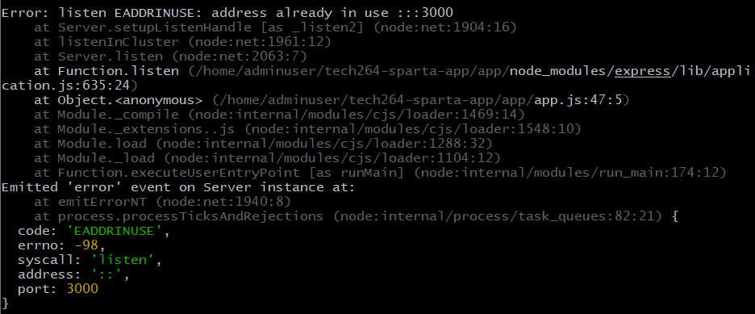

# Learning Linux

## Introduction to Linux

Linux is an open-source, stable, and scalable operating system widely used in DevOps and beyond. Originating as a clone of Unix—which ran on large systems—Linux efficiently operates on both large servers and small devices. It offers numerous distributions (distros) like Ubuntu and Fedora, catering to diverse user needs. The Bash shell serves as an interpreter for Linux commands, enabling command-line interaction and scripting for automation.

## Linux commands

Displays the operating system name.
```bash
uname
```
Shows all available system information.
```bash
uname -a
```
Displays the current user's username.
```bash
whoami
```
Shows the process information of the current shell.
```bash
ps -p $$
```
Lists previously entered commands in the shell.
```bash
history
```
Re-executes the command at the specified history number.
```bash
!<number>
```
Clears the entire command history.
```bash
history -c
```
Lists all files and directories, including hidden ones.
```bash
ls -a
``` 
Lists all files and directories with detailed information.

```bash
ls -al
```
Downloads a file from the internet and saves it as <file_name>.
```bash
curl <url> --output <file_name>
```

Downloads a file from the internet and saves it as `<file_name>`.

```bash
wget <url> -O <file_name>
```
Renames or moves a file.

```bash
mv <file_name> <new_file_name>
```

Displays the file type and related information.

```bash
file <file_name>
```

Copies a file to a new file.

```bash
cp <file_name> <new_file_name>
```
Removes a file.

```bash
rm <file_name>
```
Creates a new directory; multiple names create multiple directories.

```bash
mkdir <directory_name>
```

Does not remove directories; use rmdir instead.

```bash
rm <directory_name>
```
Removes an empty directory.

```bash
rmdir <directory_name>
```

Removes a directory and its contents recursively.

```bash
rm -r <directory_name>
```

Escape character; ignores the special meaning of the next character.

```bash
\
```

Creates an empty file or updates the timestamp of an existing file.

```bash
touch <file_name>
```

Displays the contents of a file.

```bash
cat <file_name>
```

Opens a file for editing; creates it if it doesn't exist.

```bash
nano <file_name>
```

Displays the first <number> lines of a file.

```bash
head -<number> <file_name>
```

Displays a file with line numbers.

```bash
nl <file_name>
```

Searches the file for lines containing <word> and prints them.

```bash
cat <file_name> | grep <word>
```

Installs the specified package (requires superuser privileges).

```bash
sudo apt install <package_name>
```

Updates the package list.

```bash
sudo apt update
```

Installs 'tree' to display directories in a tree-like format.

```bash
sudo apt install tree
```

Upgrades all installed packages to the latest versions (use with caution).

```bash
sudo apt upgrade -y
```

Switches to the superuser account (use with caution; remember to exit when done).

```bash
sudo su
```

## How to Write a Bash Script.
 
1. use `nano provision.sh` to begin creating your `provision.sh` file, which will host the script.
2. In the nano interface, write the following lines (be sure to write comments using `#` to help with understanding):
   1. `#!/bin/bash`, which i called "**shebang**". This specifies which interpreter should be used to execute the script - so this tells it to use the **Bash** script.
   2. `sudo apt update -y`
   3. `sudo apt upgrade -y`
   4. `sudo apt install -y nginx`
   5. `sudo systemctl restart nginx`
   6. `sudo systemctl enable nginx`
3. Save the script by clicking `CTRL+S`, then exit the script by clicking `CTRL+X` to return back to your regular linux CL.
4. Since the default **permissions** do not allow you to execute the script, use `chmod +x provision_nginx.sh` to add **execution** **permissions** to the file.
5. Run the script using `./provision.sh`.

## Environment Variables

Environment variables are placeholders for data, representing values stored in memory that can be accessed by various tools or applications.

To set an environment variable in your shell:

```bash
export <ENV_NAME>=<value>
```

To list all currently set environment variables:

```bash
printenv
```

How to make environment variables persistent (for the same user)

To make environment variables persistent across sessions, you need to modify the user's shell configuration.

* Method 1: Edit the `.bashrc` File

1. Open the `.bashrc` file with a text editor:

```bash
nano .bashrc
```

2. Add the following line at the end of the file:

```bash
export export <ENV_NAME>=<value>
```

3. The environment variable will be automatically set each time the system starts for that user.

* Method 2: Append to `.bashrc` via Command Line

1. You can append the variable directly to the .bashrc file using the echo command:

```bash
echo "export <ENV_NAME>=<value>" >> .bashrc
```

2. The environment variable will be automatically set each time the system starts for that user.

## Processes

A process is an instance of a program running in memory. It may be actively using CPU resources or sitting idle.

* **Single-core CPUs** process one instruction at a time.
* **Multi-core CPUs** can execute multiple processes simultaneously.
Commands to list

### Commands to List Processes

To display currently running processes:

```bash
ps
```

To show all processes on the system:

```bash
ps -e

```

To display detailed information about processes, including the user, process ID, CPU, and memory usage:

```bash
ps aux
```

To view a dynamic, real-time list of system processes, use the top command:

```bash
top
```

In `top`, you can sort processes dynamically:

* `Shift + M`: Sort by memory usage.
* `Shift + P`: Sort by CPU usage.
* `Shift + N`: Sort by process start time (newest first).

### Listing Real-Time Processes

To see a list of real-time processes:

```bash
jobs
```

Use jobs -l for more detailed information, including process IDs (PIDs).

```bash
jobs -l
```

### Running Processes

Run a process for a set time

Example `sleep` command (Usage: pauses execution for <number> of seconds.)

```bash
sleep <number>
```

To run a process in the background, append an ampersand (&):

```bash
sleep 5000 &
```

### Terminating Processes

Command to Kill a Process

You can terminate a process using the kill command with its process ID (PID).

**Gentle termination:** Sends the SIGHUP signal to restart the process.

```bash
kill -1 <process_id>
```

**Moderate termination:** Sends the SIGTERM signal, allowing the process to shut down gracefully.

```bash
kill <process_id>
```

**Forceful termination:** Sends the SIGKILL signal, which forcefully ends the process without giving it a chance to clean up. Use with caution as it can create zombie processes (child processes that remain in memory without a parent).

```bash
kill -9 <process_id>
```

### Why Brute-force Killing Can Be Risky

Using `kill -9` terminates the process immediately but can leave child processes orphaned (zombie processes), which may continue running or consume resources. It's best to try a gentle or moderate kill first to allow processes to shut down properly and clean up any associated resources.

## Managing file ownership.

### Why is managing file ownership important?

Managing file ownership is essential for controlling access to files and directories, ensuring that only authorized users can read, modify, or execute them. This maintains system security and prevents unauthorized access.

### What is the command to view file ownership?

Use ls -l to view detailed information about files, including their ownership and permissions.

### What permissions are set when a user creates a file or directory? Who does the file or directory belong to?

When a user creates a file or directory, default permissions are set based on the system's umask value. Typically, a new file gets permissions like rw-r--r-- (644), and a new directory gets rwxr-xr-x (755). The file or directory belongs to the user who created it and their primary group.

### Why does the owner, by default, not receive execute permissions when they create a file?

Because most new files are regular data files, not executable programs, the system does not grant execute (x) permissions by default to prevent accidental execution of non-executable files.

### What command is used to change the owner of a file or directory?

Use the chown command to change the owner of a file or directory. For example: chown new_owner filename.

## Managing file permissions.

### Does being the owner of a file mean you have full permissions on that file? Explain.

No, being the owner of a file does not automatically grant you full permissions. Your access is determined by the user (owner) permission settings for that file. While the owner can change the file's permissions, they are still restricted to the permissions currently assigned to them.

### If you give permissions to the User entity, what does this mean?

Granting permissions to the User entity sets the actions that the file's owner can perform. These permissions apply exclusively to the owner and define their ability to read, write, or execute the file.

### If you give permissions to the Group entity, what does this mean?

Granting permissions to the Group entity defines what all users who are members of the file's group can do. These permissions apply to every user in that specific group, dictating their access levels.

Groups that the owner belongs to as well.

### If you give permissions to the Other entity, what does this mean?

Granting permissions to the Other entity sets the permissions for all other users on the system who are neither the owner nor part of the file's group. These permissions determine the access rights for anyone else trying to interact with the file.

### You give the following permissions to a file: User permissions are read-only, Group permissions are read and write, Other permissions are read, write, and execute. You are logged in as the user who is the owner of the file. What permissions will you have on this file? Explain.

As the owner, you will have read-only permissions on the file because the user (owner) permissions are set to read-only. Even though the group and other entities have more permissions, they do not affect the owner's access. The system checks permissions in the order of user, group, then other, applying only the first applicable set.

### Here is one line from ls -l. Work out everything you can about permissions on this file or directory.

-rwxr-xr-- 1 tcboony staff 123 Nov 25 18:36 keeprunning.sh

* File Type: - indicates it's a regular file.
* Owner Permissions (rwx): The owner (tcboony) has read (r), write (w), and execute (x) permissions—full access.
* Group Permissions (r-x): Users in the group staff have read (r) and execute (x) permissions but no write permission.
* Other Permissions (r--): All other users have read-only (r) permission.
* Link Count: 1 means there is one hard link to the file.
* Owner: The file is owned by user tcboony.
* Group: The file's group is staff.
* Size: The file is 123 bytes.
* Last Modified: The file was last modified on November 25 at 18:36.
* Filename: The name of the file is keeprunning.sh.

## Managing file permissions using numeric values

### What numeric values are assigned to each permission?

* Read (r): 4
* Write (w): 2
* Execute (x): 1

### What value can you assign to get read + write permissions?

Add the numeric values of read and write:

* Read (4) + Write (2) = 6

So, the value 6 assigns read and write permissions.

### What value would assign read, write, and execute permissions?

Add all three permission values:

* Read (4) + Write (2) + Execute (1) = 7

So, the value 7 assigns read, write, and execute permissions.

### What value would assign read and execute permissions?

Add the numeric values of read and execute:

* Read (4) + Execute (1) = 5

So, the value 5 assigns read and execute permissions.

### Often, a file or directory's mode/permissions are represented by 3 numbers. What do you think 644 would mean?

The three numbers represent permissions for the User (owner), Group, and Others, respectively.

* 6 (User): Read (4) + Write (2) = Read and Write permissions.
* 4 (Group): Read (4) = Read-only permission.
* 4 (Others): Read (4) = Read-only permission.

Therefore, 644 means:

* The owner has read and write permissions.
* The group has read-only permission.
* Others have read-only permission.

## Changing file permissions

### What command changes file permissions?

The chmod command is used to change file permissions.

### To change permissions on a file, what must the end user be? (2 answers)

The user must either:

* Be the owner of the file.
* Have superuser (root) privileges.

### Give examples of some different ways/syntaxes to set permissions on a new file (named testfile.txt) to:

#### Set User to read, Group to read + write + execute, and Other to read and write only

Using symbolic notation:

```bash
chmod u=r,g=rwx,o=rw testfile.txt
```

Using numeric notation:

Calculate permissions:
* User (u): read (4) = 4
* Group (g): read (4) + write (2) + execute (1) = 7
* Other (o): read (4) + write (2) = 6

```bash
chmod 476 testfile.txt
```

#### Add execute permissions (to all entities)

```bash
chmod a+x testfile.txt
```

#### Take write permissions away from Group

```bash
chmod g-w testfile.txt
```

#### Use numeric values to give read + write access to User, read access to Group, and no access to Other

Calculate permissions:

* User (u): read (4) + write (2) = 6
* Group (g): read (4) = 4
* Other (o): no permissions = 0

```bash
chmod 640 testfile.txt
```

## Using scp (Secure Copy)

The scp command is straightforward and works similarly to the cp command, but allows you to copy files to/from a remote server using SSH.

```bash
scp -i /path/to/your/private-key-file -r /path/to/local/app-folder username@your-vm-public-ip:/path/to/remote/destination
```

Generate curiosity
signpost - presentation overview
less is more - assertion & evidence
mix things up - audience engagement - questions & activities
dich script


sudo DEBIAN_FRONTEND=noninteractive apt-get install -y mongodb-org=7.0.6 mongodb-org-database=7.0.6 mongodb-org-server=7.0.6 mongodb-mongosh=2.1.5 mongodb-org-mongos=7.0.6 mongodb-org-tools=7.0.6


## Making a Database in Azure - MongoDB
 
`sudo apt-get install gnupg curl` :
- `gnupg` : This is the GNU Privacy Guard, a tool for encrypting files and managing keys. It's often used for securely managing software repositories, verifying signatures, and other cryptographic functions.
 
1. Download PGP:
```
curl -fsSL https://www.mongodb.org/static/pgp/server-7.0.asc | \
   sudo gpg -o /usr/share/keyrings/mongodb-server-7.0.gpg \
   --dearmor
```
This command downloads the PGP (Pretty Good Privacy) public key for MongoDB version 7.0 and converts it to a .gpg file format using gpg. The resulting key is then stored in /usr/share/keyrings/ for use in authenticating MongoDB packages during installation. It ensures the packages are coming from a trusted source.
 
2. Register MongoDB to the system:
```
echo "deb [ arch=amd64,arm64 signed-by=/usr/share/keyrings/mongodb-server-7.0.gpg ] https://repo.mongodb.org/apt/ubuntu jammy/mongodb-org/7.0 multiverse" | sudo tee /etc/apt/sources.list.d/mongodb-org-7.0.list`
```
This command registers the MongoDB 7.0 repository to your system, ensuring that MongoDB packages will be fetched from the official source and verified with the correct GPG key during installation.
 
3. Run update:
```
sudo DEBIAN_FRONTEND=noninteractive apt update -y
```
Running sudo apt update is necessary to update the package lists from all configured repositories.
 
4. Install MongoDB components:
```
sudo DEBIAN_FRONTEND=noninteractive apt-get install -y mongodb-org=7.0.6 mongodb-org-database=7.0.6 mongodb-org-server=7.0.6 mongodb-mongosh=2.1.5 mongodb-org-mongos=7.0.6 mongodb-org-tools=7.0.6
```
This command installs specific versions of MongoDB components (version 7.0.6 for MongoDB and 2.1.5 for the MongoDB shell) in a non-interactive mode.
 
5. Status check:
```
sudo systemctl status mongod
```
Check the status of mongod. It will not be active.
 
6. Start up:
```
sudo systemctl start mongod
```
Starts mongod. If you then re-run status, it will read as active.
 
7. Change bindIp:
```
sudo nano /etc/mongo.conf
```
Nanos into the mongo configuration file and locate `bindIp`. Replace whatever is there with `0.0.0.0`. Allows connections from any IP.
 
8. Restart:
```
sudo systemctl restart mongod
```
This applies the changes we made in the config file.
 
9. Check if it's enabled:
```
sudo systemctl is-enabled mongod
```
It should read as disabled, so we will enable it.
 
10. Enable it:
```
sudo systemctl enable mongod
```
This will enable MongoDB, which then should be enabled on our VMs whenever we boot it up.

## Automating VMs to Run Apps and DBs (Updated with pm2, reverse proxy, run in Azure user data)

### Automating App VM

Running the below script configures a VM running on **Linux Ubuntu 22.04 LTS Gen 2** to run an Application by:

* Updating packages.
* Upgrading packages.
* Installing the NGINX web service.
* Configuring NGINX reverse proxy to divert traffic to port 3000.
* Testing the validity of the configured NGINX file.
* Restarting NGINX to apply changes.
* Installing Node.js v 20_x.
* Checking Node version.
* Installing pm2 (process manager).
* Cloning a git repo by specifying the HTTPS URL.
* Changing directories to point to the app.js file within the repo (within root directory - as the script is run in user data)
* Setting an environment variable (DB_HOST) that is looked up when the app runs.
* Stopping all processes managed by pm2.
* Installing app dependencies and packages.
* Running the app in the background via pm2.


```bash
#!/bin/bash

NGINX_CONFIG="/etc/nginx/sites-available/default"

# Updatingading packages.
echo update sources list...
sudo apt-get update -y
echo Done!

# Upgrading packages.
echo upgrade any packages available...
sudo DEBIAN_FRONTEND=noninteractive apt-get upgrade -y
echo Done!

# Installing the NGINX web service.
echo install nginx...
sudo DEBIAN_FRONTEND=noninteractive apt-get install nginx -y
echo Done!

# Use sed to update the config to proxy traffic from port 80 to 3000
echo "Updating Nginx configuration to remove port 3000..."
sudo sed -i 's|try_files $uri $uri/ =404;|proxy_pass http://localhost:3000;|' /etc/nginx/sites-available/default
echo Done!

# Test the Nginx configuration
echo testing nginx config file validation
sudo nginx -t
echo Done!

# Restart Nginx to apply changes
echo "Restarting Nginx..."
sudo systemctl restart nginx
echo Done!

# Installing Node.js v 20_x.
echo install nodejs v20...
curl -fsSL https://deb.nodesource.com/setup_20.x | sudo -E bash - &&\
sudo DEBIAN_FRONTEND=noninteractive apt-get install -y nodejs
echo Done!

# Checking node version.
echo check nodejs version...
node -v
echo Done!

# Installing pm2.
echo installing pm2...
sudo npm install -g pm2
echo Done!

# Cloning a git repo by specifying the HTTPS URL.
echo cloning github repository...
git clone https://github.com/AdonisAlgos/tech264-sparta-app.git repo
echo Done!

# Changing directories to point to the app.js file within the repo.
echo changing directories to the app folder...
cd repo/app
echo Done!

# Setting an environment variable (DB_HOST) that is looked up when the app runs.
echo defining env variable
export "DB_HOST=mongodb://10.0.3.4:27017/posts"
echo Done!

# Stop all processes managed by pm2
echo Stopping all pm2 processes
pm2 stop all
echo Done!

# Installing app dependencies and packages.
echo installing app packages and dependencies...
npm install
echo Done!

# Running the app in the background via pm2.
echo running app...
pm2 start app.js
echo app running in the background...
```

### Automating DB VM

Running the below script configures a VM running on **Linux Ubuntu 22.04 LTS Gen 2** to host a Database by:

* Updating packages.
* Upgarding packages.
* Installing gnupg and curl.
* Download and add MongoDB GPG key for package verification.
* Add MongoDB repository to the sources list.
* Update package list again to include the newly added MongoDB repository
* Install MongoDB version 7.0.6 and specific associated packages.
* Enable MongoDB service.
* Modify MongoDB configuration to allow remote connections.
* Restart MongoDB service to apply configurations

```bash
#!/bin/bash

# Update the system package list
echo Updating package list...
sudo apt-get update -y
echo Done!

# Upgrade all installed packages to their latest versions
echo Upgrading installed packages...
sudo DEBIAN_FRONTEND=noninteractive apt-get upgrade -y
echo Done!

echo Installing gnupg and curl...
sudo apt-get install gnupg curl
echo Done!

# Download and add MongoDB GPG key for package verification
echo Adding MongoDB GPG key...
sudo rm -f /usr/share/keyrings/mongodb-server-7.0.gpg # Remove key if one exists
curl -fsSL https://www.mongodb.org/static/pgp/server-7.0.asc | sudo gpg --yes -o /usr/share/keyrings/mongodb-server-7.0.gpg --dearmor
echo Done!

# Add MongoDB repository to the sources list
echo Adding MongoDB repository to sources list...
echo "deb [ arch=amd64,arm64 signed-by=/usr/share/keyrings/mongodb-server-7.0.gpg ] https://repo.mongodb.org/apt/ubuntu jammy/mongodb-org/7.0 multiverse" | sudo tee /etc/apt/sources.list.d/mongodb-org-7.0.list
echo Done!

# Update package list again to include the newly added MongoDB repository
echo Updating package list with MongoDB repository...
sudo DEBIAN_FRONTEND=noninteractive apt-get update -y
echo Done!

# Install MongoDB version 7.0.6 and specific associated packages non-interactively
echo Installing MongoDB and related packages...
sudo DEBIAN_FRONTEND=noninteractive apt-get install -y mongodb-org=7.0.6 mongodb-org-database=7.0.6 mongodb-org-server=7.0.6 mongodb-mongosh=2.1.5 mongodb-org-mongos=7.0.6 mongodb-org-tools=7.0.6
echo Done!

# Enable MongoDB service to start on boot
echo Enabling MongoDB service to start on boot...
sudo systemctl enable mongod
echo Done!

# Modify MongoDB configuration to allow remote connections
echo Configuring MongoDB to allow remote connections...
sudo sed -i 's/127.0.0.1/0.0.0.0/g' /etc/mongod.conf
echo Done!

# Restart MongoDB service to apply configurations
echo Restarting MongoDB service...
sudo systemctl start mongod
echo Done!
```

## Task: How many services can use a port?

Only one service can use a specific port on a given IP address at a time.

**Error when running another instance of the sparta app.**



### Resolving Port Conflicts on Linux: Freeing Up Port 3000

1. Identify the Process Using Port 3000: Run the following command to find out which process is using port 3000:

```bash
sudo lsof -i :<port_number>
```

2. Terminate the Process: Use the kill command with the PID to stop it:

```bash
sudo kill <PID>
```

3. Verify Port Availability (Optional): Run the lsof command again to check if port 3000 is now free:

```bash
sudo lsof -i :<port_number>
```

## Reverse Proxy

A reverse proxy is a server that receives client requests, forwards them to backend servers, and returns the response to the client. It enhances: Load Balancing: Spreads traffic across multiple servers, Security: Hides backend server details and can enforce SSL,Caching

### Manually Configuring Reverse Proxy.

Create a back-up for the coonfiguration file

```bash
sudo cp /etc/nginx/sites-available/default /etc/nginx/sites-available/default.bak
```

Edit configuration file in nano text editor

```bash
sudo nano /etc/nginx/sites-available/default
```

Nginx configuration file - How to be adjusted.

```bash
server {
    listen 80;
    server_name your_domain.com;  # Change this to your domain or IP
 
    location / {
        # try_files $uri $uri/ =404; Replace with below
        proxy_pass http://localhost:3000;
    }
}
```

Check if configuration file is valid.
```bash
sudo nginx -t
```

Restart nginx to apply configurations.

```bash
sudo systemctl restart nginx
```

### Reverse Proxy Automation.

Installing NGINX.

```bash
 # Installing the NGINX web service.
echo install nginx...
sudo DEBIAN_FRONTEND=noninteractive apt-get install nginx -y
echo Done!
```

Configuring nginx to reverse proxy (divert traffic) to port 3000.

```bash
# Modifying the nginx configuration file to transfer traffic to port 3000.
echo modifying nginx config file...
sudo sed -i 's/try_files $uri $uri/ =404;/proxy_pass http://localhost:3000;/g' /etc/nginx/sites-available/default
echo Done!
```

Restarting nginx to apply configurations.

```bash
# Restarting nginx to apply configurations
echo restarting nginx...
sudo systemctl restart nginx
echo Done!
```

*Note: Nginx is configured as enabled by default so no need to manually enable the service*

## Task: Run Sparta app in the background

Work out ways to both run, stop and re-start the app in the background (besides using the "&" at the end of the command):

### Issue with using this method when it comes to stopping/re-starting the app

The issue with managing the state of the app without a process manager is that we would manually have to terminate run the app

### Use pm2 to start and stop the app in your app script
 
#### pm2: Commands
* `pm2` : A production process manager that allows you to run your apps in the background, keep them alive (restart automatically if they crash), monitor performance, and handle logs.
 
* `pm2 start npm -- start` : Tells PM2 to start a new process using the npm command to execute the start script defined in your package.json. It launches your Node.js application in the background
 
* `pm2 stop npm` :  If you have multiple processes managed by PM2 that were started with the npm -- start, you can stop them all using this command. This effectively halts the application, but does not remove it from PM2's process list.
 
* `pm2 restart npm` : This command restarts the running process associated with the npm command. PM2 will first stop the current instance and then start it again, ensuring any updates or changes are applied.
 
* Don't forget to install PM2 in your script using `sudo npm install -g pm2`. The `-g` installs this globally, meaning we can access PM2 from any terminal window without needing to be in a specific project directory.

### Automating pm2 to run our app.

Installing pm2 (process manager).

```bash
# Installing pm2.
echo installing pm2...
sudo npm install -g pm2
echo Done!
```

If any processes are occupying our ports stop them.

```bash
# Stop all processes managed by pm2
echo Stopping all pm2 processes
pm2 stop all
echo Done!
```

Run our app in the background managed by pm2.

```bash
# Running the app in the background via pm2.
echo running app...
pm2 start app.js
echo app running in the background...
```

## Task: Automate app Stage 3 - Automate app deployment with user data

Things to consider:

* When running the script in user data it is run within the root directory.
* Meaning the app needs to be accessed from the root directory.

You can find the implementation in [`updated app script`](./prov-app-script).

## Create an Image from a VM

### Create a Custom Generalized Image

**Prepare the VM for Generalization:**

* SSH into your working database VM (this VM should be fully configured).

* Run the following commands to deprovision and generalize the VM:
```bash
sudo waagent -deprovision+user
```

**Capture the Image:**

* In the Azure Portal, navigate to the VM you just prepared.
* Click on Capture > Image in the toolbar.

**In the capture image window:**

* Enter tech264-firstname-ready-to-run-database-image as the name of the image.
* Select the Resource group for the image.
* Set gallery sharing to > No.
* Check the option to Automatically delete the VM after creating the image.
* Click Review + Create to create the image.
* The new custom generalized image will be created and saved in your selected resource group.

### Creating a New VM from the image

Create a New VM Using the Custom Image:

1. In the Azure Portal, navigate to the resources section.
2. Select the image you created (tech264-firstname-ready-to-run-database-image).
3. Click + Create VM to begin creating a new VM based on this image.

### Summary of our Sparta App

1. We followed the steps of - Create a Custom Generalized Image & Creating a New VM from the image - for our Database VM.
2. We then did the same for the Application VM + we added a script to:
   *  Set the DB_Host environment variable that acts as our database connection.
   *  Changed directory to point to the app folder.
   *  Stopped all existing processes run by pm2.
   *  Start the app.js file via pm2

You can find the implementation in [`userdata app script`](./userdata-app-script.sh).

